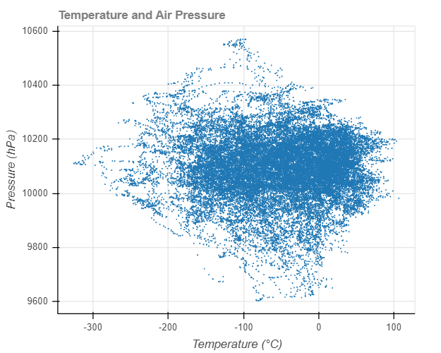

# Bokeh-Plotting-Weather-Data
&#8226; Plotting weather-related data using Bokeh library in Python.
  
&#8226; The Python code is stored in Jupyter notebook named **Plotting_Weather_Data.ipynb**.
  
&#8226; The output file is created as **Weather.html** file.
  
&#8226; The **snapshot** of the graph is:-
  

